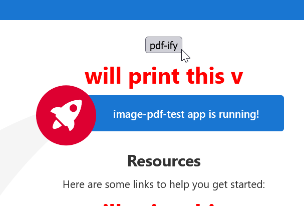

# ImagePdfTest

small test for server-side generation of pdfs w/ browser-generated screenshots

- ngx-capture for screenshots
- pdfkit for pdfs
- express for server

## to run

Run `ng serve` for a dev server. Navigate to `http://localhost:4200/`. The application will automatically reload if you change any of the source files.

Run `npm run dev` for the express server

Use `#highlight` on any elements to be captured

